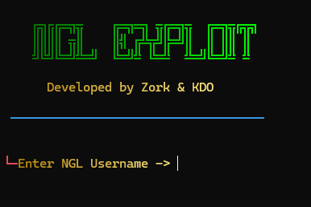

# 🔬 NGL-FloodX – Educational Automation Tool

<p align="center">
  

</p>

<p align="center">
  
  
  
  
</p>

## 📘 Overview

**NGL-FloodX** is an educational tool developed to demonstrate the fundamentals of **Api automation**, **API interaction**, and **system environment adaptation** using NGL.link profiles. This project is intended for **research and learning purposes only**, helping users understand how automated requests are structured and executed in real-world applications.

The tool supports **Windows**, **Linux**, and **Android (Termux)** environments, and includes features such as **encrypted configuration files**, **system detection**, and **cross-platform compatibility**.

---

## 🎓 Educational Highlights

This project serves as a practical resource for learning:

- Cross-platform development using Python and Node.js  
- System environment detection and adaptive behavior  
- Secure file encryption/decryption workflows  
- Basics of web request automation and API usage  
- Ethical considerations in automation and software development  

---

## ⚙️ Installation

### ✅ Prerequisites

- **Python 3.x**
- **Node.js** (Required for Windows users)
- Active **internet connection**

### 📥 Setup Instructions

```bash
# Clone the repository
git clone https://github.com/samay825/NGL-FloodX.git

# Navigate to the project directory
cd NGL-FloodX

# Install required dependencies
pip install -r requirements.txt
```

### ▶️ Run the Tool

```bash
# On Windows
python main.py

# On Linux / Termux
python3 main.py
```

```markdown
## 🔐 ZIP Password for Extraction
samaykdobhaihesamjha1234567890#
```


##

📢 **Stay Updated:**  
Join our Telegram channels for password updates and support:
- [@sincryption](https://t.me/sincryption)
- [@teamillusionofficial](https://t.me/teamillusionofficial)

---

## 🚀 Usage

After successful extraction and setup:

### For Windows
```bash
python run.py
```

### For Linux / Termux
```bash
python3 run.py
# OR (recommended for Termux)
bash run.sh
```

---

## ⚠️ Disclaimer

> **This tool is strictly for educational and research purposes.**

By using **NGL-FloodX**, you agree to the following:

- Use it **only on your own accounts** or with **explicit permission**  
- Do **not** use it for **spam**, **harassment**, or **malicious intent**  
- Respect **rate limits** and **terms of service** of any platform  
- Apply the knowledge **ethically and responsibly**

The developers **condemn any misuse** of this tool and are **not liable** for any damages or consequences arising from improper use.

---

## 📜 License

This project is licensed under the **MIT License**.  
See the [LICENSE](./LICENSE) file for more information.

---

## 👨‍💻 Credits

Developed by **Zork X Kdo**  
For educational and research purposes only.

---

## 📬 Support & Feedback

For inquiries or support, feel free to reach out via our Telegram channels:
- [@sincryption](https://t.me/sincryption)
- [@teamillusionofficial](https://t.me/teamillusionofficial)

---

> ⚠️ **Note:** Unauthorized or malicious use of this tool may violate the terms of service of platforms like NGL.link. Always ensure responsible usage in compliance with applicable laws and ethical guidelines.

---

